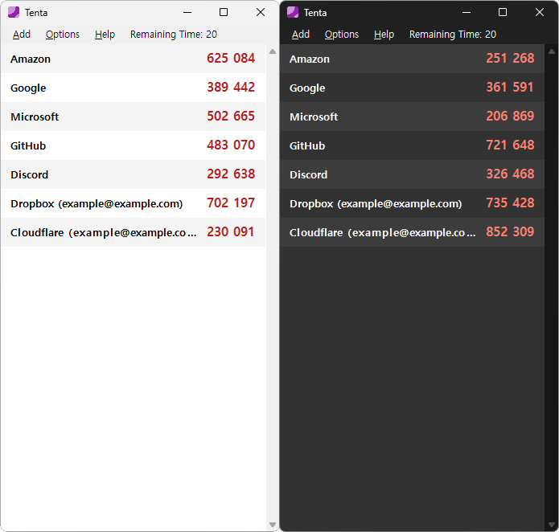

# Tenta

A WinForms OTP client because why not

## Features

- Add from QR code, `otpauth://` URI, or manually
- Double click to copy to clipboard

## Why use Tenta?

- I needed one
- Completely offline
- Kinda lightweight, no bullsh*t, almost-not-ugly interface
- Proudly not encrypting anything at all (might change later)

## Known Issues

- Only TOTP is supported
- Remaining Time counter is only for the first entry, entries with different period may not show up correctly
- Many lovely flickers but that's what I get for using WinForms

## Requirements

- .NET 9 Desktop Runtime

## License

Tenta is distributed under the MIT license. See [LICENSE](LICENSE) file for more information.